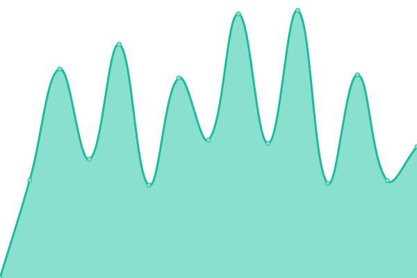

# [📈 Live Status](https://kdcer.github.io/upptime): <!--live status--> **🟧 Partial outage**

This repository contains the open-source uptime monitor and status page for [kdcer](https://kdcer.github.io/upptime), powered by [Upptime](https://github.com/upptime/upptime).

With [Upptime](https://upptime.js.org), you can get your own unlimited and free uptime monitor and status page, powered entirely by a GitHub repository. We use [Issues](https://github.com/kdcer/upptime/issues) as incident reports, [Actions](https://github.com/kdcer/upptime/actions) as uptime monitors, and [Pages](https://kdcer.github.io/upptime) for the status page.

<!--start: status pages-->
<!-- This summary is generated by Upptime (https://github.com/upptime/upptime) -->
<!-- Do not edit this manually, your changes will be overwritten -->
<!-- prettier-ignore -->
| URL | Status | History | Response Time | Uptime |
| --- | ------ | ------- | ------------- | ------ |
|  [营销平台账号中心后台](https://account.dgshare.com) | 🟥 Down | [.yml](https://github.com/kdcer/upptime/commits/HEAD/history/.yml) | 

 2108ms
     
 | 

<a href="https://kdcer.github.io/upptime/history/">99.78%</a>
    

|  [营销平台直播后台](https://live.console.dgshare.com) | 🟥 Down | [.yml](https://github.com/kdcer/upptime/commits/HEAD/history/.yml) | 

 2108ms
     
 | 

<a href="https://kdcer.github.io/upptime/history/">99.78%</a>
    

|  [营销平台API](https://api.dgshare.com) | 🟩 Up | [api.yml](https://github.com/kdcer/upptime/commits/HEAD/history/api.yml) | 

 2422ms
     
 | 

<a href="https://kdcer.github.io/upptime/history/api">99.78%</a>
    

|  [上海购物API](https://api.shopping-shanghai.com/api/v1/home/index) | 🟩 Up | [api.yml](https://github.com/kdcer/upptime/commits/HEAD/history/api.yml) | 

 2422ms
     
 | 

<a href="https://kdcer.github.io/upptime/history/api">99.78%</a>
    

|  [第一八佰伴楼层导览](https://sum.kdcer.com/bbb-shopping/view/index.html?LevelId=1) | 🟥 Down | [.yml](https://github.com/kdcer/upptime/commits/HEAD/history/.yml) | 

 2108ms
     
 | 

<a href="https://kdcer.github.io/upptime/history/">99.78%</a>
    

|  [test](https://google.com) | 🟩 Up | [test.yml](https://github.com/kdcer/upptime/commits/HEAD/history/test.yml) | 

 118ms
     
 | 

<a href="https://kdcer.github.io/upptime/history/test">100.00%</a>
    

<!--end: status pages-->

[**Visit our status website →**](https://kdcer.github.io/upptime)

## 📄 License

- Powered by: [Upptime](https://github.com/upptime/upptime)
- Code: [MIT](./LICENSE) © [kdcer](https://kdcer.github.io/upptime)
- Data in the `./history` directory: [Open Database License](https://opendatacommons.org/licenses/odbl/1-0/)
